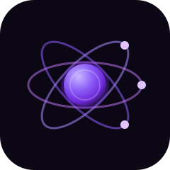

  

# ⚛️ Nexus AI

A beautiful, multi-provider AI chatbot with an animated atom logo and a resilient provider fallback chain.

## 📖 Overview

Nexus AI is a modern, intelligent assistant that answers any question — general knowledge, math, coding, science, history, writing, translation. It uses a multi-provider fallback architecture so it never goes down: if one AI provider runs out of credits, Nexus automatically switches to the next.

## ✨ Features

- 💬 Chat with an AI assistant
- ⚛️ Animated atom logo with glowing nucleus
- 💾 Chat history saved locally
- 🔗 Multi-provider fallback (Cerebras → Cloudflare → OpenRouter)
- 🎨 Beautiful purple gradient theme
- 📊 Shows which provider answered each message
- 📚 Multiple chats in the sidebar

## 🛠️ Tech Stack

| Layer | Technology |
|-------|-----------|
| Frontend | Streamlit |
| AI Chat (Primary) | Cerebras (llama3.1-8b) |
| AI Chat (Fallback 1) | Cloudflare Workers AI (llama-3.1-8b) |
| AI Chat (Fallback 2) | OpenRouter (llama-3.3-70b:free) |
| Language | Python 3.10+ |
| Storage | Local JSON (chat history) |

## 🔗 Multi-Provider Architecture

Nexus AI uses a provider chain so it never fails due to a single provider running out of credits:

Chat → 1. Cerebras (llama3.1-8b — fastest)
         ↓ (fails)
       2. Cloudflare Workers AI (llama-3.1-8b — serverless)
         ↓ (fails)
       3. OpenRouter (llama-3.3-70b:free)
         ↓ (fails)
       ❌ Error

You only need one provider key to start, but adding all three means zero downtime.

## 📂 Project Structure

my-ai-chatbot/
├── app.py                # Main Streamlit app
├── requirements.txt      # Python dependencies
├── chat_history.json     # Auto-generated — chat history
├── logos/
│   └── nexus.svg         # Nexus AI logo (used in README and app)
├── LICENSE               # MIT License
├── .gitignore            # Git ignore rules
└── README.md

## ⚙️ Installation (Local)

1. Clone the repository

git clone https://github.com/Faizan-Ali-00/my-ai-chatbot.git
cd my-ai-chatbot

2. Create a virtual environment

Windows:
python -m venv venv
venv\Scripts\activate

macOS / Linux:
python3 -m venv venv
source venv/bin/activate

3. Install dependencies

pip install -r requirements.txt

4. Set up your API keys

Create a .env file in the root directory:

CEREBRAS_API_KEY=csk_your_cerebras_key_here
CLOUDFLARE_API_KEY=your_cloudflare_token_here
CLOUDFLARE_ACCOUNT_ID=your_cloudflare_account_id_here
OPENROUTER_API_KEY=sk-or-v1-your_openrouter_key_here

You only need one of these to work. Add all three for maximum resilience.

## 🔑 Getting Free API Keys

| Provider | Free Tier | Get Key |
|----------|-----------|---------|
| Cerebras | 1M tokens/day · 30 req/min | https://cloud.cerebras.ai/ |
| Cloudflare Workers AI | 10,000 req/day | https://dash.cloudflare.com/profile/api-tokens |
| OpenRouter | 50 req/day · 20+ free models | https://openrouter.ai/keys |

### Cloudflare Account ID

1. Log in to https://dash.cloudflare.com/
2. Go to Workers & Pages
3. Find Account details on the right
4. Copy the Account ID

## 🚀 Deployment (Streamlit Cloud)

1. Push to GitHub

git add .
git commit -m "Deploy Nexus AI"
git push origin main

2. Deploy on Streamlit Cloud

1. Go to https://share.streamlit.io/
2. Click New app
3. Select your repo: Faizan-Ali-00/my-ai-chatbot
4. Main file path: app.py
5. Click Deploy

3. Add your API keys as Secrets

Important: Never put API keys in app.py on GitHub — they become public. Use Streamlit Secrets instead.

1. Go to share.streamlit.io → your app → ⋮ → Settings
2. Click the Secrets tab
3. Paste your keys:

CEREBRAS_API_KEY = "csk_your_cerebras_key_here"
CLOUDFLARE_API_KEY = "your_cloudflare_token_here"
CLOUDFLARE_ACCOUNT_ID = "your_account_id_here"
OPENROUTER_API_KEY = "sk-or-v1-your_openrouter_key_here"

4. Click Save → Reboot app

## ▶️ Usage

1. Type a message to chat with the assistant
2. Chat history is saved locally
3. Each response shows which provider answered
4. Create multiple chats from the sidebar

## 🎨 UI Highlights

- Atom logo — glowing nucleus with 3 orbital rings and electrons
- Purple gradient — matches the app theme
- Chat bubbles — glassmorphism with colored left border
- Sidebar — dark purple with brand logo and chat list
- Provider status — shows which providers are active

## 🔒 Security Notes

- Never commit .env to GitHub
- Always use Streamlit Secrets for deployed apps
- Revoke keys immediately if accidentally exposed
- Store each provider's key separately for easy rotation

## 🤝 Contributing

1. Fork the repository
2. Create a feature branch: git checkout -b feature/AmazingFeature
3. Commit your changes: git commit -m "Add some AmazingFeature"
4. Push to the branch: git push origin feature/AmazingFeature
5. Open a Pull Request

## 📄 License

This project is licensed under the MIT License.

## 👤 Author

Faizan Ali
GitHub: https://github.com/Faizan-Ali-00
Repository: https://github.com/Faizan-Ali-00/my-ai-chatbot

## ⭐ Show Your Support

If this project helped you, please give it a star on GitHub — it means a lot!

## 🙏 Acknowledgments

Cerebras — https://cerebras.ai
Cloudflare Workers AI — https://developers.cloudflare.com/workers-ai/
OpenRouter — https://openrouter.ai
Streamlit — https://streamlit.io
